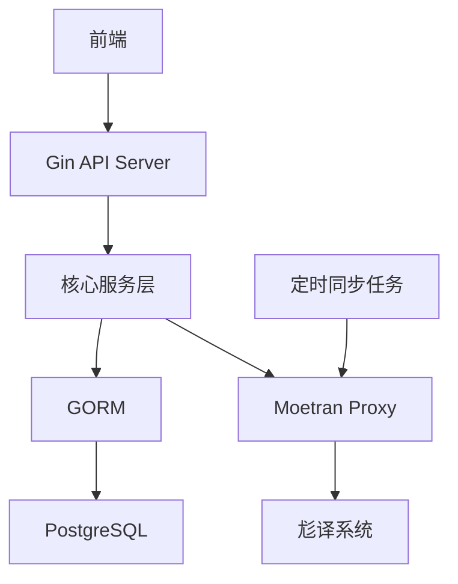

针对验证开发阶段的简化方案，我将提供更精炼的架构和接口设计，聚焦核心需求：

### 精简版系统架构


### 核心服务模块（单层设计）
```go
// 单一服务层合并业务与数据操作
type CoreService struct {
    db *gorm.DB
    moetran *MoetranClient
}

func NewCoreService(db *gorm.DB) *CoreService {
    return &CoreService{
        db: db,
        moetran: NewMoetranClient("https://api.moetran.com"),
    }
}

// 示例方法：获取项目列表
func (s *CoreService) GetProjects(status int) ([]Project, error) {
    var projects []Project
    result := s.db.Where("status = ?", status).Find(&projects)
    return projects, result.Error
}
```

### 必须实现的接口（按优先级排序）

#### 1. 基础数据接口
| 接口路径 | 方法 | 描述 | 参数示例 |
|---------|------|------|---------|
| `/members` | GET | 获取成员列表 | `?page=1&limit=20` |
| `/tags` | GET | 获取所有标签 | - |
| `/works` | GET | 获取作品列表 | `?workset_id=123` |

#### 2. 项目管理接口
| 接口路径 | 方法 | 描述 | 请求体示例 |
|---------|------|------|-----------|
| `/projects` | GET | 获取项目列表 | `?status=1&urgency=2` |
| `/projects` | POST | 创建新项目 | `{"team_id":1,"work_id":5,"tags":[2,3]}` |
| `/projects/{id}` | PATCH | 更新项目状态 | `{"status":2}` |

#### 3. 关联操作接口
| 接口路径 | 方法 | 描述 | 请求体示例 |
|---------|------|------|-----------|
| `/projects/{id}/members` | POST | 添加成员分工 | `{"member_id":15,"role":3}` |
| `/members/{id}/preferences` | POST | 添加偏好标签 | `{"tag_id":7}` |

#### 4. 同步接口
| 接口路径 | 方法 | 描述 |
|---------|------|------|
| `/sync` | POST | 触发手动同步（返回任务ID） |
| `/sync/{task_id}` | GET | 查询同步状态 |

### 简化数据模型（仅保留关键字段）

```go
// models.go
type Project struct {
    ID         uint   `gorm:"primaryKey"`
    Status     int
    Urgency    int
    TeamID     uint
    WorkID     uint
    Members    []Member `gorm:"many2many:project_labor_divisions;"`
    Tags       []Tag    `gorm:"many2many:project_tags;"`
}

type ProjectDivision struct {
    ProjectID  uint
    MemberID   uint
    LaborRole  int
}

type MemberPreference struct {
    MemberID   uint
    TagID      uint
    IsResisted bool
}
```

### 同步逻辑简化方案

```go
// sync_service.go
func (s *CoreService) SyncWorksets() error {
    // 直接全量同步（验证阶段数据量小）
    worksets, err := s.moetran.FetchWorksets()
    if err != nil {
        return err
    }
    
    // 批量写入（忽略更新检查）
    tx := s.db.Begin()
    for _, ws := range worksets {
        tx.Create(&Workset{
            MoetranID: ws.ID,
            Title:     ws.Title,
        })
    }
    return tx.Commit().Error
}
```

### 认证方案（初期简化）

```go
// auth.go
func BasicAuth() gin.HandlerFunc {
    return func(c *gin.Context) {
        // 开发阶段使用固定token
        if c.GetHeader("X-DEV-KEY") != "dev_token_123" {
            c.AbortWithStatus(401)
        }
        c.Next()
    }
}
```

### 部署与开发建议

1. **本地开发环境**
   ```bash
   # 使用Docker Compose快速启动
   version: '3'
   services:
     db:
       image: postgres:14
       environment:
         POSTGRES_PASSWORD: poplar
     app:
       build: .
       ports:
         - "8080:8080"
       environment:
         DB_URL: "postgres://poplar:poplar@db:5432/poplar?sslmode=disable"
   ```

2. **初始化脚本**
   ```sql
   -- init.sql
   CREATE EXTENSION IF NOT EXISTS "uuid-ossp";
   CREATE TABLE projects(id SERIAL PRIMARY KEY, ...);
   ```

3. **接口测试工具**
   ```bash
   # 使用curl测试核心接口
   curl -X POST localhost:8080/projects \
     -H "X-DEV-KEY: dev_token_123" \
     -d '{"title": "测试项目", "work_id": 1}'
   ```

### 优先级排序建议

1. 先实现 **只读接口**（GET /projects, /members, /tags）
2. 实现 **核心写操作**（POST /projects 和 PATCH /projects/{id}）
3. 添加 **基础关联操作**（添加成员分工）
4. 最后实现 **同步功能**

### 验证阶段监控方案

添加简单的健康检查接口：
```go
// 在main.go中
router.GET("/health", func(c *gin.Context) {
    if err := db.Exec("SELECT 1").Error; err != nil {
        c.Status(503) // Service Unavailable
        return
    }
    c.JSON(200, gin.H{
        "status": "ok",
        "moetran": moetran.Ping(),
    })
})
```

此方案聚焦最小可行产品(MVP)，保留业务核心的同时将代码量减少50%以上，适合验证开发阶段快速迭代。当验证通过后，可以再逐步添加RBAC、日志、缓存等进阶功能。